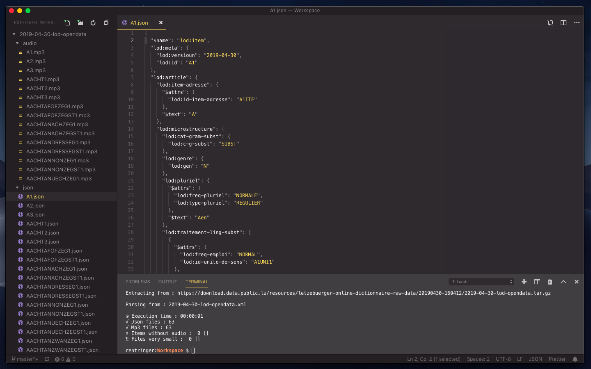

# Lod Extract

A Node script for extract data of the Lëtzebuerger Online Dictionnaire (LOD).

Author : [Roberto Entringer](https://robertoentringer.com)
License: MIT
Npm package : https://www.npmjs.com/package/lod-extract

## Installation / Usage

```shell
$ npm install lod-extract
```
or

```shell
$ npx lod-extract
```

[](screenshot2.png?raw=true)

# Dependencies

Node dependencies: [xml-flow](https://www.npmjs.com/package/xml-flow), [tar](https://www.npmjs.com/package/tar)

# Data source

Data from the "Lëtzebuerger Online Dictionnaire" (LOD)
Website: http://www.lod.lu
Source: https://data.public.lu/fr/datasets/letzebuerger-online-dictionnaire/
Licence: Creative Commons Zero (CC0)

[](https://data.public.lu/fr/datasets/letzebuerger-online-dictionnaire/)
